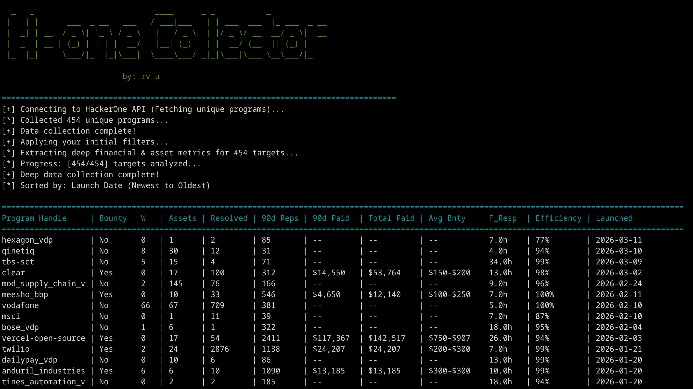

```text
  _   _                          ____      _ _           _            
 | | | |      ___  _ __   ___   / ___|___ | | | ___  ___| |_ ___  _ __ 
 | |_| | __  / _ \| '_ \ / _ \ | |   / _ \| | |/ _ \/ __| __/ _ \| '__|
 |  _  | __ | (_) | | | |  __/ | |__| (_) | | |  __/ (__| || (_) | |  
 |_| |_|     \___/|_| |_|\___|  \____\___/|_|_|\___|\___|\__\___/|_|  
                                                                      
                          by: rv_u
```


## H-One Collector (HackerOne Recon Sniper)
H1 Collector is a powerful, fast, and smart CLI tool designed specifically for Bug Bounty Hunters.

It connects directly to the HackerOne GraphQL API to fetch, filter, analyze, and sort all public bug bounty programs based on real-time financial metrics, competition (90-day reports), and scope types (Wildcards, Mobile, Domains).

Stop wasting time clicking through pages! Find the most generous, highly-responsive, and least-crowded programs in seconds.


# Features

- Deep Financial Metrics: Extracts "Total Paid", "Paid in Last 90 Days", and "Average Bounty" for every program.

- Scope Extractor: Instantly extracts all eligible Wildcards and Domains for a specific target and saves them to .txt files.

- Smart Filtering: Filter programs by assets (-w Wildcards, -m Mobile, -d Domains) or by payment types (-B Bounties only, -V VDP only).

- Minimum Bounty Filter: Only show programs that pay above a specific average amount (e.g., -b 1000).

- Competition Sorting: Sort programs by the least number of reports submitted in the last 90 days.

- Export to CSV: Save your custom-filtered targets list into a .csv file for easy tracking.


# Installation

1- Clone the repository:
```
git clone https://github.com/RaV-u/H-OneCollector.git
```
2- Install the required dependencies:
```
pip install -r requirements.txt
```

# Configuration (Important)
Since HackerOne requires authentication to fetch accurate metrics, you need to provide your own Session Cookie and CSRF Token.

1- Log in to your HackerOne account.

2- Open Developer Tools (F12) -> Network tab.

3- Refresh the page and look for a graphql request.

4- Copy your __Host-session cookie and your X-CSRF-Token.

5- Open H-OneCollector and replace the placeholder values at the top of the file:

```
SESSION_COOKIE = "__Host-session=YOUR_SESSION_COOKIE_HERE"
CSRF_TOKEN = "YOUR_CSRF_TOKEN_HERE"
```

# Usage & Examples

1. General Radar (Newest Programs):

Fetches all programs and sorts them from newest to oldest.
```
python3 H-OneCollector.py
```

2. The Scope Extractor (Instant Recon):

Extracts all eligible in-scope Wildcards and Domains for your target like "PayPal" and saves them into TXT files: (paypal_wildcards.txt).
```
python H-OneCollector.py paypal
```

3. Target Low-Competition Wildcards:

Finds all Wildcard programs and sorts them by the least amount of reports submitted in the last 90 days.
```
python H-OneCollector.py -w -c least
```

4. The "High Payer" Filter:

Finds programs that pay bounties (-B), have an average bounty of at least $1000 (-b 1000), and sorts them by the best response efficiency (-c eff).
```
python H-OneCollector.py -B -b 1000 -c eff
```

5. VDP / Reputation Hunting:

Finds programs that DO NOT pay money (VDP) but have Wildcards, perfect for building reputation.
```
python H-OneCollector.py -V -w -c least
```

6. Export Results:
  
Export your highly customized target list to a CSV file.
```
python H-OneCollector.py -w -B -c least -o my_targets.csv
```

# By: ( Ramez Medhat => Happy Hacking )
